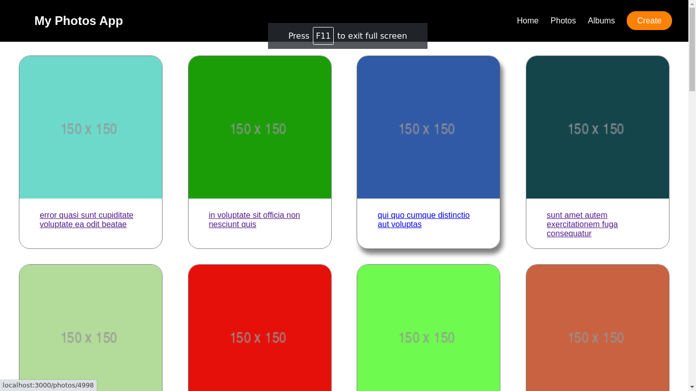

# My Photos App.



## What is this Application About ?

A CRUD Application which query its data from [https://graphqlzero.almansi.me/api](https://graphqlzero.almansi.me/api)

## Note: Particular components

- In the `src/components/photos/EditablePhoto.js` path you will find a component based in React Hooks.
- In the `./src/components/photos/__test__/NewPhotoContainer.test.js` path you will find a unit test for the NewPhotoContainer.js component.

## Source File Structure

``` 
.
├── components
│   ├── albums
│   │   └── styles
│   └── photos
│       └── styles
├── helpers
├── layout
│   └── styles
├── pages
│   ├── albums
│   └── photos
└── styles
```

## Steps to install and run this project locally.
1. Clone repository: `git clone `
2. Install Node Modules: `npm install`
3. Run NPM Start `npm start`
4. Open [http://localhost:3000](http://localhost:3000) to view it in the browser.

### Quick recipe:
```
git clone  && npm install && npm start
```

## Available Scripts

In the project directory, you can run:

### `npm start`

Runs the app in the development mode.<br />
Open [http://localhost:3000](http://localhost:3000) to view it in the browser.

The page will reload if you make edits.<br />
You will also see any lint errors in the console.

### `npm test`

Launches the test runner in the interactive watch mode.<br />
See the section about [running tests](https://facebook.github.io/create-react-app/docs/running-tests) for more information.

### `npm run build`

Builds the app for production to the `build` folder.<br />
It correctly bundles React in production mode and optimizes the build for the best performance.

The build is minified and the filenames include the hashes.<br />
Your app is ready to be deployed!

### `npm run format`

To format all the `.js` code in the `src` folder using `prettier`.

